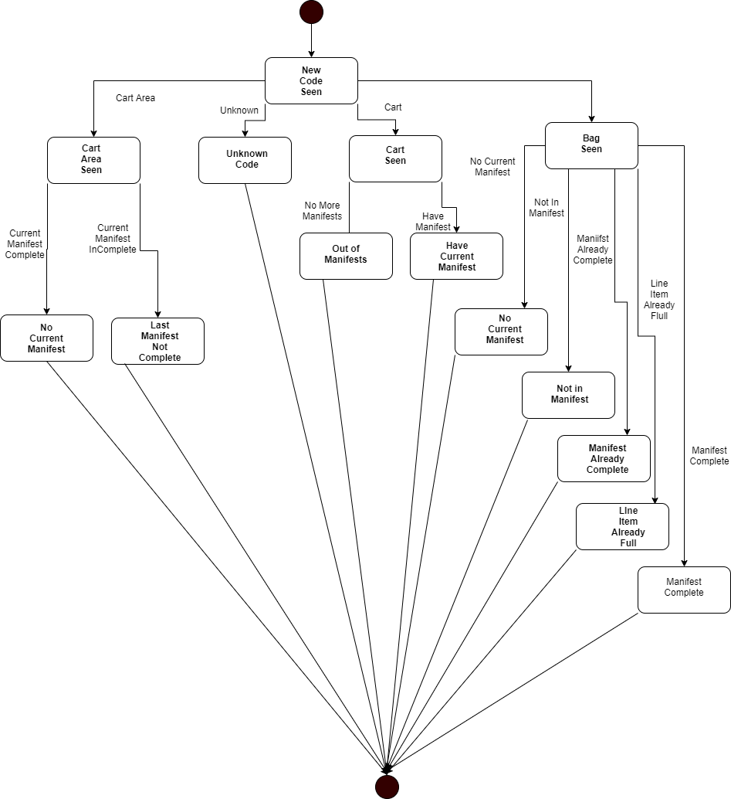
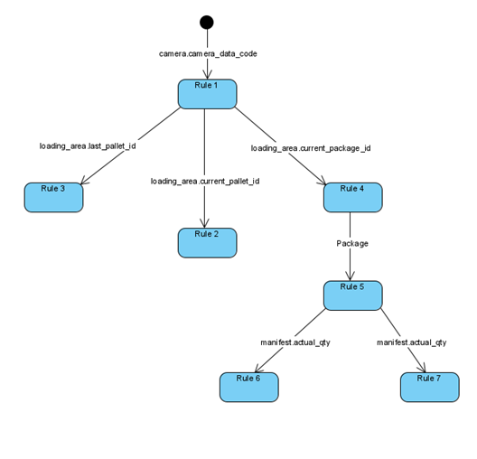

# Gaia Baggage Advisor template

---

**NOTE**

The information contained in this document represents information about prerelease features of the product. Features might change when the product is released for general availability.

---

Gaia Platform is a low-code programming environment for applications at the edge. The Baggage Advisor template provides a complete application that  demonstrates how Gaia interacts with other systems such as ROS2 and how Gaia's low-code rules can make development faster and more approachable.

Baggage Advisor's job is to provide supervisory guidance to humans working to deliver passengers their baggage. The motivation behind the Gaia Baggage Advisor template is the need to quickly and efficiently update core business logic for custom versions of the business logic, perhaps at a different airport. By placing Gaia Platform at the center of this application, you can make these modifications faster, saving time and other integration costs.

## Prerequisites

-   Gaia SDK (available by request)
-   ROS2 Foxy. For information about installing ROS2 Foxy, see [Installing ROS 2 via Debian Packages](https://docs.ros.org/en/foxy/Installation/Ubuntu-Install-Debians.html) on the ROS2 documentation site. 
-   Hardware: 
    -   A camera connected to the host computer (typically mounted at /dev/video0)

## Installing the template 

The Gaia Baggage Advisor template follows the canonical ROS2 workspace setup and build process. The installation process assumes that you have installed ROS2 foxy and have followed the steps to [initialize rosdep](https://docs.ros.org/en/foxy/Installation/Ubuntu-Install-Binary.html?highlight=rosdep#installing-and-initializing-rosdep).

The Gaia Baggage Advisor repository includes:

-   Source code for the Gaia Baggage Advisor template 
-   Source code for the ROS2 data exchange with the camera 
-   QR codes representing the assets needed to run a demonstration scenario

The repository containing the template is available on GitHub:  

[https://github.com/gaia-platform/baggage_advisor_template](https://github.com/gaia-platform/baggage_advisor_template)

To install the Gaia Baggage Advisor template run the following commands:

```
~$ mkdir -p ~/ros2_ws/src && cd ~/ros2_ws/src
~/ros2_ws/src$ git clone
git@github.com:gaia-platform/baggage_advisor_template.git
~/ros2_ws/src$ cd ~/ros2_ws  
~/ros2_ws$ source /opt/ros/foxy/setup.bash
~/ros2_ws$ rosdep install --from-paths src --ignore-src -r -y
~/ros2_ws$ colcon build
~/ros2_ws$ source install/local_setup.bash
```

## Scenario

When the application is running, the barcode scanner reads image streams from a physical camera and sends messages with the identified code to other components. The main Baggage Advisor component receives barcode messages into its database which causes interaction with the Gaia rules engine
The UI then displays the live video feed with visual overlays indicating the application’s status.

The relevant concepts in this scenario are as follows:

-   **Loading area**, represented as a barcode. This is where carts are to be loaded.
-   **Carts**, represented as a barcode. When a cart obscures the underlying packing area, the Baggage Advisor app knows it's time to load the cart.
-   **Manifest**, represented in the database. When a cart is detected, it is paired with an as-yet-unfulfilled manifest.  Manifests list the quantity and types of different packages to be loaded on the cart.
-   **bag,** represented as a barcode. The bag can be of a type and is requested in a certain quantity.

In this example, you won’t need to have access to an airport or even a special-purpose camera to see how Gaia can interact with cameras and UIs over ROS2 middleware or to get a good sense of how Gaia rules drive the application’s behavior. Rather, you can make use of the included barcodes (printed on paper) and any camera connected to your computer. Once the application is running, just show the codes to your camera. There’s even a script you can follow below.

## How it works

Baggage Advisor works by consuming data from a stationary camera feed and identifying barcodes that indicate the presence of different items (i.e. carts, bag, the loading area itself). In a production setting, the camera is mounted in a fixed location and monitors the loading area. As barcodes are detected, they are sent as ROS2 messages to the Gaia Platform module. Gaia low-code rules dictate the next step in the process or identify errors for the human operator to respond to.

The following state diagram shows the decisions that take place when the application detects a barcode. The primary actions are setting states in the Gaia database and sending messages that indicate the meaning of those states to the UI.

<pre>
Loading area barcode read.
    Is there a current manifest being fulfilled?
        There is no manifest being fulfilled.

        The current manifest is not complete.

Cart barcode read.
    There are no more manifests to fulfill.

    There is a manifest that needs fulfilling.

Bag barcode read.
    There are no more manifests to fulfill.

    There is no manifest being fulfilled.

    Current Manifest is already complete

    Item already fulfilled in manifest

    Item completes the manifest

Unknown barcode
    Do nothing.
</pre>

The Gaia Baggage Advisor template breaks this behavior into simple, concise
rules that fire when the data is updated in the Gaia database.



**<u>Fig. ‘New Code Seen’ State Machine</u>**

## Rules

Gaia low-code or declarative rules work in conjunction with the Gaia database. When a rule references an Active Field in the database, an update to that field causes the Gaia rule to execute.

Before looking at the rules, you should review the structure of the database. The database is defined in the Baggage Advisor.ddl file located in the gaia_control/src/ folder.

The template defines seven declarative rules to implement the entire application's business logic or 'mission.' These rules are implemented in the Baggage Advisor.ruleset file located in the gaia_control/src folder. You can look at these rules and their comments to get a sense of how they work and what fields cause them to fire.

Data changes to a field that is referred to in a rule cause the rule to execute. There are two ways to set up this functionality. One way is to prepend the name of a field with the “@” symbol. Think of this as
setting that field to an Active Field. The other is to wrap the body of the rule with an OnUpdate(fieldname) expression. You will see examples of both in this ruleset.

Finally, a quick overview of the rules and the data they react to make it easier to see how rules and data fields interconnect:

```
// The camera sees a new code
//
// Reacts to: camera.camera_data_code
// Changes: 
//      cart_area.last_cart_id
//      cart_area.current_cart_id
//      cart_area.current_baggage_id
//      camera.camera_data_code
//        

// A cart has moved onto or off of a cart area
//
// Reacts to: cart_area.current_cart_id
// Changes:
// Creates: cart
//

// If last_cart_id changes, check if the cart's manifest was fully loaded
// before it moves off the cart area
//
// Reacts to: cart_area.last_cart_id
// Changes:
//

// A bag has moved onto a cart area. Create the associated baggage row
// and reset the current_baggage_id field.
//
// Reacts to: cart_area.current_baggage_id
// Changes: cart_area.current_baggage_id
// Creates: baggage
//

// A bag has moved onto a cart area, and this rule checks if the baggage is
// not in the current cart's manifest or if there is no manifest on the cart.
//
// Reacts to: cart_area.current_baggage_id
//

// A bag has moved onto a cart area, and this rule checks if there is no cart
// in the cart area to put a bag onto.
//
// Reacts to: cart_area.current_baggage_id
//

// A bag has been added to a manifest
//
// Reacts to: baggage.LastOperation
// Changes: manifest.actual_qty
//

// Check if manifest is full
//
// Reacts to: manifest.actual_qty
// Changes: manifest.state
//

// Check if manifest line item is over full
//
// Reacts to: manifest_baggage.actual_qty
// Changes:
//
```

## Rule Chaining

When the value of an Active Field of the database changes, the Gaia rules engine automatically fires the rule. When a rule is fired, it can in turn change additional fields. If those fields are designated as active in a rule, the rules engine will fire the associated rules. We call this *forward chaining*. The combination of rules firing automatically and then cascading to the execution of other rules is the basis for the declarative system.

The following figure shows process flow as implemented in the Gaia ruleset with forward chaining:



**<u>Fig.</u> <u>Chaining Path</u>**

This approach simplifies the diagram, providing an easier to understand and follow representation of the process flow.

**NOTE**: The complexity of the relationships might be more complex than shown in the chaining table because rules can use non-active fields in addition to active fields to change system state.

## Demonstration Scenario

The demonstration simulates an airport baggage handling facility. It uses a single camera to read Barcodes that represent three object types:

-  Loading area
-  Carts
-  Bags

The manifests and other system scenario data are created each time you
run the application.

In total, eight barcodes are presented to the camera in sequence.

-   One loading area
-   Three carts
-   Three bags
-   One object of unknown type

The barcodes are provided in the qr_codes.pdf which is located in the demo_assets of the Baggage Advisor template repository.

The three manifests have line items as follows:

-   Manifest 1:
    -   bag: A, qty: 1
-   Manifest 2:
    -   bag: A, qty: 1
    -   bag: B, qty: 1
-   Manifest 3:
    -   bag: C, qty: 3

## Scenario Sequence

To observe this template in operation, run the following command:

```
~/ros2_ws$ ros2 launch gaia_control baggage_advisor.launch.py video_device:=/dev/video0
```

Now that the application is running, a window will appear. Select the **refresh** icon in the top-left and then select the webcam/image_marked topic.

You are now ready to start presenting the included barcode files to the camera in the following sequence.

Runtime scenario 1:
-   Show loading area
-   Show cart 1
-   Show bag A
    -   Indicate remove cart operation

Runtime scenario 2:
-   Show blank
-   Show bag A
    -   Error is indicated: too many packages

Runtime scenario 3:
-   Show loading area
-   Show cart 2
-   Show bag A
-   Show bag B
    -   Indicate remove cart operation

Runtime scenario 4:
-   Show loading area
-   Show cart 3
-   Show bag A
    -   Error is indicated: package not in manifest

Runtime scenario 5:
-   Show bag C
-   Show blank
-   Show bag C
-   Show loading area
    -   An error is indicated: manifest not complete

Runtime scenario 6:
-   Show unknown object
    -   Error is indicated
