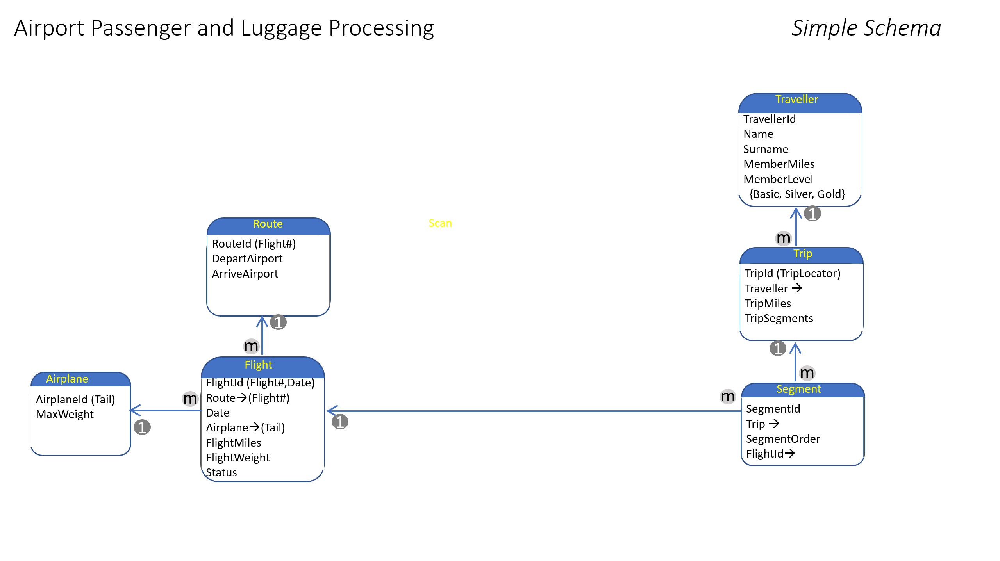

# Writing Rules with Gaia Declarative C++

Gaia rules are written in Declarative C++. Gaia Declarative C++ differs from traditional C++ in several ways:

-   It operates on database field references as well as local variables. 
-   The Gaia platform determines the execution order.
-   Implicit queries. A single statement in a declarative statement can result in iteration over all of the records in a one-to-many relationship.
-   Iteration takes place over the entire Ruleset.

In Gaia, rules and records are directly connected. What looks like variables are actually references to fields in specific database rows; there is no need to declare the variables. In a rule, data that resides in the Gaia database are field references. When data changes in the database, Rules that deal with that data are executed automatically.

Field references do not have type declarations in a Ruleset; the translation engine automatically supplies the Database Schema definitions. In the declarative language environment, you reference fields by simplified names, which Gaia converts into code-based
accessors. Depending on the relationships in your schema, the field reference can return 0,1, or multiple rows. In the case in which the return is multiple rows.

In addition to the Ruleset level declarations, you can declare any number of local variables at the start of a specific Rule using standard C++ syntax, such as *int BagCount*. Local variables are scoped to individual rules, not to Rulesets.

Picture an application that manages airplane flights, passengers, and baggage. There is a table that tracks actual flights. At the end of each flight, the unique record for that flight has a field called FlightMiles to reflect the miles flown in the flight. In another table, there is a record for each traveler reflecting MemberMiles.

You might also find that as rules grow more complex, the OnXxxx() prefix aids in readability and understanding among different developers.

Let’s start with four simple rules based on the following schema:



Member Rule 1

```cpp
// Update the number of miles the member has flown
{
    MemberMiles += @FlightMiles;
}
```


The key to understanding this Rule is that FlightMiles is designated as an Active Field. When that field is updated, the Rule engine automatically fires the rule.

Each flight has many passengers. There is a 1:many relationship between the Flight record in the database, which contains FlightMiles, and the Traveler record, which contains MemberMiles. The rules engine recognizes that relationship from the Catalog and automatically executes the Rule for every passenger on the flight. So, that one assignment causes the system to:

-   Recognize that there are many passengers on the flight.
-   Create a query to find all the passengers on this flight; the Rule is then fired once for each passenger. We call this an implicit query.
-   Starting from the Flight record, navigate to the correct Traveler record in that table for each passenger. Even here, the rules engine is automatically navigating through several intermediate records to get from Flight to Traveler.
-   Complete the update for every passenger. Implicit queries cause rules to execute against sets of records completely transparently and automatically.

Member Rule 2

```cpp
// Update member status
{
    if ( @MemberMiles &gt; 75000 ) { MembershipLevel = Silver };
}
```

In this example, MemberMiles is an Active Field. The rules engine automatically fires the Rule each time MemberMiles changes. The previous changes the value of the field and causes the rules engine to fire this rule. This is forward chaining which we discuss further in the next section.

We track each trip in a table called Trips which has a counter for TripSegments. How do we know a segment is complete? One answer could be to add a field in Flights called FlightLanded. Then we could write:

```cpp
{
   if (@FlightLanded) { TripSegments +=1}
}
```

Before moving on, let’s examine what is taking place with both of these conditional statements. A flight segment was completed. An Active Field caused the rules engine to fire a rule. That Rule relates to a particular record for a particular flight. That record, in turn, is related to many Trip records. Not only that, the path from the flight record to the appropriate trip record involves navigating through an intermediate segment record. We start with a simple one statement conditional and end up with:

-   A query is automatically generated to relate the flight record to all the appropriate segment records.
-   The Rule is executed once for each of the many trips associated with this flight.
-   The system navigates through the segment record in each case, which fires the event to update the SegmentsFlown.

```cpp
// Track weight of baggage loaded on flight
OnInsert(BaggageLoadScan)
{
    FlightWeight += Weight
}
```

In this case, the Rule is defined using the OnInsert prefix.

```cpp
// Check for overweight situation and raise the alarm
{
    If (@FlightWeight &gt; MaxWeight )
       { ActivateWeightAlarm(FlightWeight) }
}
```

Since rules are, at their core, C++ statements, you can call functions that perform external actions from the body of the rule. In the preceding rules, as luggage is loaded into the plane, luggage tags are scanned. The first Rule tracks the weight of the baggage loaded on the flight.

Through forward chaining, the rules system fires the second Rule each time the value of FlightWeight changes. If the value of FlightWeight exceeds the maximum allowed baggage weight, the Rule calls the ActivateWeightAlarm method, which is external to the rules declarations.

## Forward chaining

When the value of a field reference changes in the active database, the Rule is fired automatically. As rules get fired, they might also change fields, and those fields can, in turn, fire other rules. We call this
forward chaining. The combination of rules firing automatically and then cascading to the execution of other rules is the basis for our declarative system.

Sometimes when a field reference changes, a Rule executes against individual records. In other cases, though, a Rule might update many records. For example, after a flight lands, all the luggage might be marked as arrived. The rules engine generates the underlying query to make this work automatically so that you don’t have to. We call this an implicit query. This is a key part of eliminating control flow.

The power derives from the fact that there is no need to create queries, navigate through tables, copy and map data: Gaia handles all of that automatically. Because the database, the records, and the fields are intrinsically shared, updates are automatically shared with other parts of the application in the same copy-free fashion, making the database active. By consistently using the term fields instead of, say, variables, we are constantly reminded of this direct linkage to the records they live in.

## Transactions

Transactions are complex to think about in a world with forward chaining since cascading rules, particularly across multiple Rulesets and authors, a transaction could go on forever. For this reason, the Gaia platform focuses on the use of transactions to ensure the consistency of relatively limited operations.

The rules engine automatically brackets every Rule with a Begin and Commit Transaction sequence. All forward chaining takes place after the transaction is committed.

When a transaction aborts, usually due to a conflict with another transaction. For example, two concurrent transactions might change the same field value. In this case, the first one to commit 'wins,’ and the second one must re-execute.

In the declarative system, rules based on field changes are the only mechanism for moving from one Rule to the next; there is no explicit control flow. A single rule, particularly if it has multiple statements, might cause several other rules to fire. The rules engine waits for field changes within the bracketed transaction to be committed before allowing associated forward chaining to happen.

## Parallelism

Gaia automatically executes all rules in parallel by default. This is made possible by the Rules Engine’s managed execution environment and the implementation of transactions in the Database itself.

**Important**: Be careful when using objects that have a shared mutable state, such as static variables. There are no protections to prevent all the usual race conditions, timing, and visibility issues common in procedural programming. In short, all multithreading best practices apply when dealing with procedural code.

There are two mechanisms available to control this behavior. Primarily you can add the SerialStream(stream-name) attribute to a Ruleset to force all rules in that Ruleset to execute in a serialized fashion. Rules in Rulesets with a common stream-name never run in parallel with each other. But, be aware that serialized rules are not guaranteed to run in the same hardware thread; this means that writing code that relies on data persistence is not recommended.

For applications requiring a single-threaded approach, you can specify the number of threads that Gaia uses to process rules. To guarantee single-threaded semantics are applied, set thread\_pool\_count to 1 in the gaia.config file.

If a transaction fails due to a concurrent transaction exception, the rules engine retries the transaction. You can configure the number of retries for a transaction, and if Gaia should not retry a transaction, you can set rule\_retry\_count to 0.
